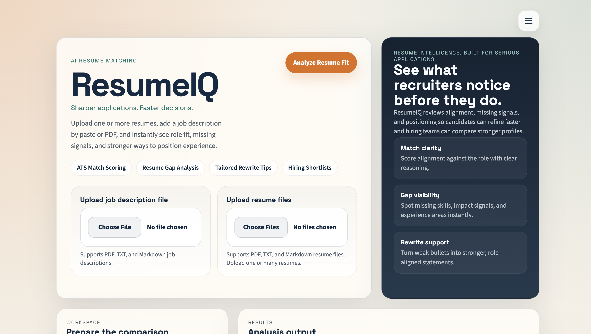
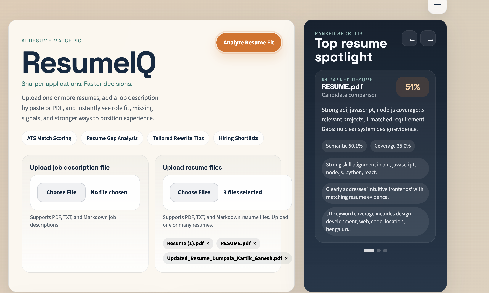
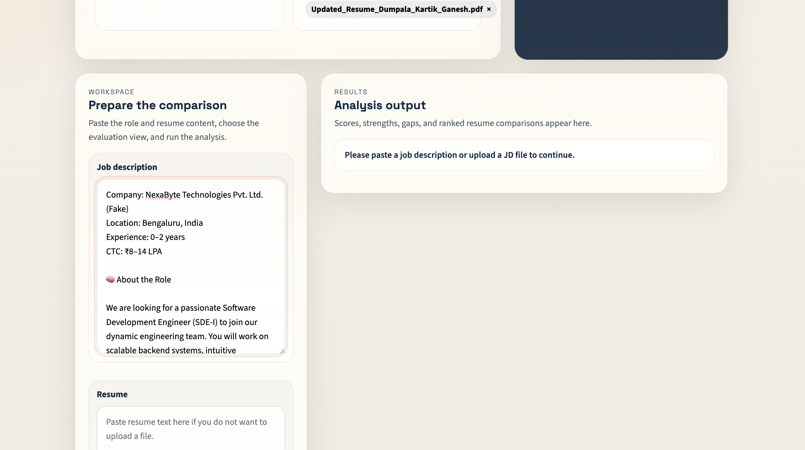
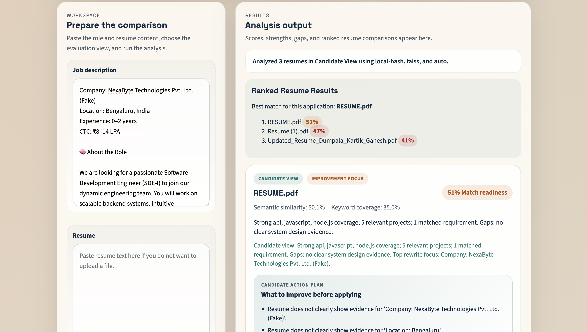
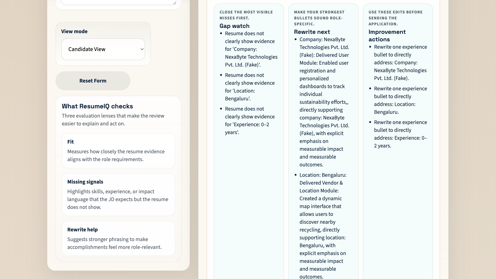
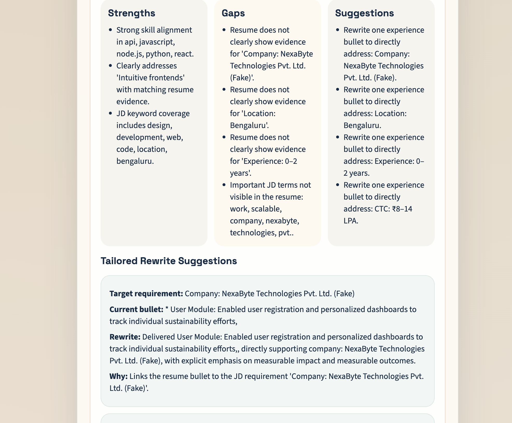

# ResumeIQ

ResumeIQ is an AI-powered web app that compares one or more resumes against a job description and returns a match score, strengths, gaps, and tailored improvement suggestions. It was built against an AI intern mini-project brief focused on resume-to-job-description matching.

## Problem Statement

Job seekers often submit resumes without knowing whether they actually align with the target role. ResumeIQ helps a candidate quickly understand:

- how well their resume matches a job description
- which job-relevant strengths are already visible
- which skills or requirements are missing
- what they should rewrite to improve their fit

The app also supports multiple resume uploads and returns a ranked shortlist, which covers the optional enhancement from the brief.

## Stack

Primary implementation:

- AI / NLP: `SentenceTransformers` by default, with optional `OpenAI`, `Gemini`, and `Hugging Face` provider support
- Vector Search: `FAISS` by default, with optional `ChromaDB` and `Pinecone` support
- Resume Parsing: `PyMuPDF` by default, with `pdfplumber` fallback and optional `Docling` hook if installed
- Backend: `FastAPI`
- Frontend / UI: `Streamlit` companion app plus the main `FastAPI` web UI

Why this is still aligned with the brief:

The brief lists suggested options, not a requirement to use every framework in every row. This project uses one coherent primary stack from the allowed options and adds optional adapters for several of the others, which makes the architecture stronger and easier to defend in a follow-up interview.

## Approach

1. Extract resume text from uploaded PDFs with `PyMuPDF`.
2. Break the resume and job description into chunks and requirements.
3. Generate embeddings with either:
   - local `SentenceTransformers`
   - `OpenAI`
   - `Gemini`
   - `Hugging Face` Inference API
   - a deterministic local fallback when no external provider is available
4. Store and query resume chunk vectors through a selectable backend:
   - `FAISS` by default
   - `ChromaDB` when `VECTOR_BACKEND=chromadb`
   - `Pinecone` when `VECTOR_BACKEND=pinecone` and Pinecone credentials are configured
5. Compare each job requirement with the most relevant resume evidence.
6. Blend semantic similarity, keyword coverage, and skill overlap into a 0-100 score.
7. Return strengths, gaps, suggestions, and optional ranking across multiple resumes.

## Architecture

```mermaid
flowchart LR
    A["Browser UI"] --> B["FastAPI App"]
    B --> C["Parser Layer"]
    C --> C1["PyMuPDF"]
    C --> C2["pdfplumber"]
    C --> C3["Docling (optional)"]
    B --> D["Embedding Provider"]
    D --> E["OpenAI Embeddings (optional)"]
    D --> F["Gemini / Hugging Face / SentenceTransformers"]
    D --> J["Local Fallback Embeddings"]
    B --> G["Vector Store Layer"]
    G --> G1["FAISS"]
    G --> G2["ChromaDB"]
    G --> G3["Pinecone"]
    G --> H["Requirement Matching"]
    H --> I["Score + Strengths + Gaps + Suggestions"]
    I --> A
```



## Project Structure

- `app/main.py`: FastAPI app and API routes
- `app/parsers.py`: PDF parsing with `PyMuPDF`, `pdfplumber`, and optional `Docling`
- `app/embeddings.py`: embedding providers across `SentenceTransformers`, `OpenAI`, `Gemini`, and `Hugging Face`
- `app/vectorstores.py`: vector store selection across `FAISS`, `ChromaDB`, and `Pinecone`
- `app/analyzer.py`: scoring, requirement matching, keyword analysis, and suggestions
- `templates/index.html`: main UI
- `static/styles.css`: visual design
- `static/app.js`: browser interactions
- `streamlit_app.py`: optional Streamlit frontend using the same analysis engine

## Setup

```bash
cd "/Users/suguna/Documents/ResumeIQ"
python3.11 -m venv .venv311
source .venv311/bin/activate
pip install -r requirements.txt
cp .env.example .env
uvicorn app.main:app --reload
```

Open [http://127.0.0.1:8000](http://127.0.0.1:8000).

The current clean runtime in this workspace is `.venv311`, built on Homebrew `Python 3.11`.

Optional Streamlit frontend:

```bash
source .venv311/bin/activate
streamlit run streamlit_app.py
```

Run tests:

```bash
source .venv311/bin/activate
python -m unittest discover -s tests -v
```

## Environment Variables

Use `.env.example` and never hardcode keys.

- `OPENAI_API_KEY`: optional, enables OpenAI embeddings
- `GEMINI_API_KEY`: optional, enables Gemini embeddings
- `HUGGINGFACE_API_KEY`: optional, enables Hugging Face inference embeddings
- `EMBEDDING_PROVIDER`: `auto`, `openai`, `gemini`, `huggingface`, `sentence-transformers`, or `local`
- `VECTOR_BACKEND`: `faiss`, `chromadb`, or `pinecone`
- `RESUME_PARSER`: `auto`, `pymupdf`, `pdfplumber`, or `docling`
- `PINECONE_API_KEY` and `PINECONE_INDEX_NAME`: required only for Pinecone mode
- `MAX_FILE_SIZE_MB`: upload limit

## Screenshots

### Landing Page

Shows the main product shell with job-description upload, multi-resume upload, and the recruiter-focused hero panel.



### Multi-Resume Upload

Shows the upload experience with multiple resumes selected before analysis.



### Workspace And Inputs

Shows the comparison workspace where the job description and resume content are prepared for analysis.



### Ranked Results

Shows the ranked shortlist view after analyzing multiple resumes against the same job description.



### Candidate View Panels

Shows the candidate-focused result layout with visible gaps, rewrite focus, and improvement actions.



### Analysis Detail

Shows the detailed strengths, gaps, suggestions, and tailored rewrite suggestions returned for a resume.



## Video Walkthrough Checklist
https://youtu.be/yyAvnXQ5ZyI

## Reflection

This project uses `FastAPI`, `PyMuPDF`, and `FAISS` because they map cleanly to the problem: resumes are often shared as PDFs, job-fit analysis benefits from vector similarity, and the API layer should stay small and testable. I also designed the embedding layer to support multiple providers including `OpenAI`, `Gemini`, `Hugging Face`, and local `SentenceTransformers`, so the application can demonstrate real AI-system design choices instead of depending on a single vendor path.

The hardest part was balancing a clean demo experience with realistic resume-matching behavior. A naive keyword matcher is easy to explain, but it breaks quickly on paraphrased job descriptions. To avoid that, I split the job description into requirement-level chunks, embedded the resume and JD content, and used `FAISS` to find the best evidence for each requirement. That creates a much better explanation layer because each match can point to the exact resume section that supports or weakens the score.

If I had more time, I would improve score calibration across a broader benchmark set of resumes and job descriptions, add richer LLM-powered bullet rewrite suggestions, and introduce stronger document validation for complex or poorly formatted PDFs. I would also add more role-specific evaluation cases so the scoring logic is easier to tune and explain during production use.
# ResumeIQ_WebApp
